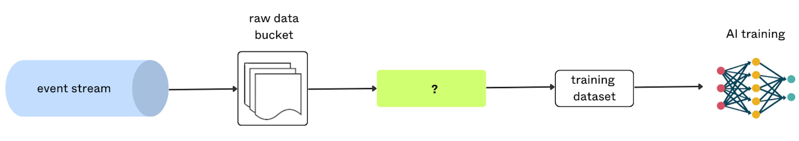

# Write-Audit-Publish with Bauplan and Temporal
A reference implementation of the write-audit-publish (WAP) pattern with Bauplan and Temporal

## Overview

A common need on S3-backed analytics systems (e.g. a data lakehouse) is safely ingesting new data into tables available to downstream consumers. 



Due to their distributed nature and large quantity of data to be bulk-inserted, a lakehouse ingestion is more delicate than the equivalent operation on a traditional database. 

Data engineering best practices suggest the Write-Audit-Publish (WAP) pattern, which consists of three main logical steps:

* Write: ingest data into a ''staging'' / ''temporary'' section of the lakehouse - the data is not visible yet to downstream consumers;
* Audit: run quality checks on the data, to verify integrity and quality (avoid the ''garbage in, garbage out'' problem);
* Publish: if the quality checks succeed, proceed to publish the data to the main section of the lakehouse - the data is now visible to downstream consumers; otherwise, raise an error / clean-up etc.

This repository showcases how [Temporal](https://temporal.io) and [Bauplan](https://www.bauplanlabs.com/) can be used to implement WAP in a few lines of no-nonsense Python code: no knowledge of the JVM, SQL or Iceberg is required.

## Setup

### Bauplan

[Bauplan](https://www.bauplanlabs.com) is the programmable lakehouse: you can load, transform, query data all from your code (CLI or Python).

If you don't have a Bauplan key for the free sandbox, require one [here](https://www.bauplanlabs.com/#join). Complete the [3 min tutorial](https://docs.bauplanlabs.com/en/latest/tutorial/index.html) to check your setup and get familiar with the platform.

Note: the current SDK version is `0.0.3a337` but it is subject to change as the platform evolves - ping us if you need help with any of the APIs used in this project.

### Setup your Python environment

Install the required dependencies in a virtual environment:

```bash
python3 -m venv venv
source venv/bin/activate
pip install -r requirements.txt
```

Make a copy of the `local.env` file as `.env` and fill in the required values for the WAP flow: the name of the table, the name of the branch (in the usual [format](https://docs.bauplanlabs.com/en/latest/concepts/branches.html): <username>.<branch>), the S3 path containing the files to ingest (if using the sandbox, make sure the bucket has public reads enabled), the namespace. For example:

```bash
TABLE_NAME=temporal_test
BRANCH_NAME=jacopo.temporal_test
S3_PATH=s3://my-public-bucket/taxi-2024/yellow_tripdata_2024-01.parquet
NAMESPACE=temporal
```

### Temporal

Install Temporal server locally, for example using [brew or other supported methods](https://learn.temporal.io/getting_started/python/dev_environment/), and start it up in one terminal:

```bash
brew install temporal
temporal server start-dev
```

## Run the flow

To run the flow we need to run the Temporal application. We will need to open a new terminal and run the following command:

```bash
python run_workflow.py
```

## Where to go from here

TBC -> Temporal Cloud

## License

The code in the project is licensed under the MIT License (Temporal and Bauplan are owned by their respective owners and have their own licenses). 